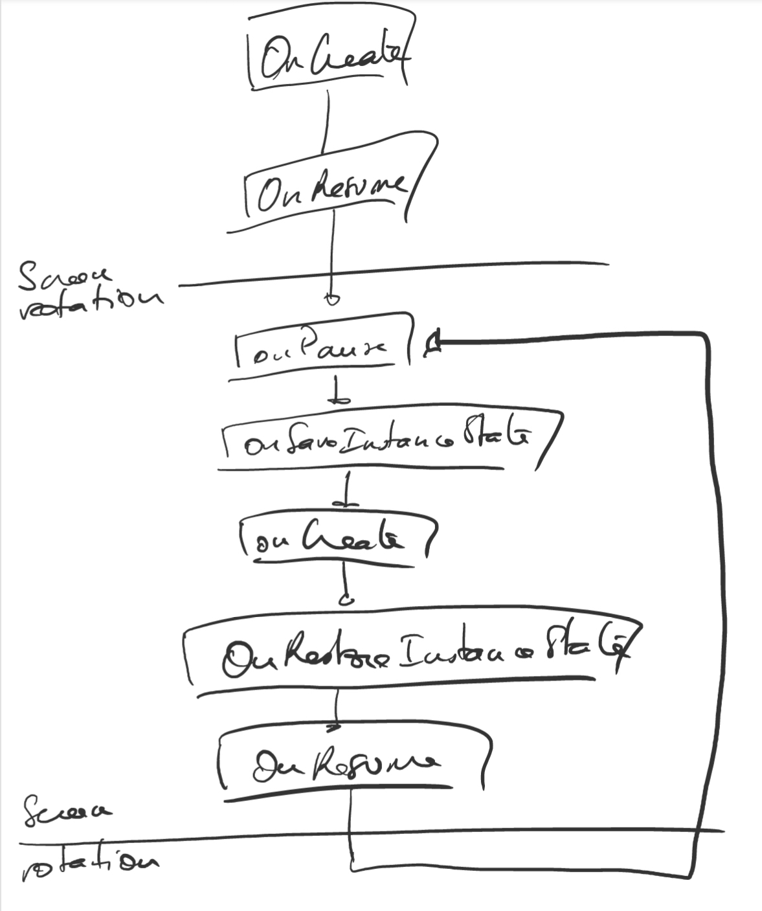

# MediaPlayer

## Objectives

The objectives of this application are to witness the Activity lifecycle and the several methods that are invoked when an Activity changes in state.
To do so, we make use of an audio track that plays when the phone rotates to landscape mode or pauses the track when it rotates to portrait mode.

## Description of the inner working of the app

If you recall, I had troubles making the audio resume to where it stopped. So in this section, I will try to describe how the application actually works.



The issue came from the following method:

``` java
protected void onPause() {
    super.onPause();
    Log.d("Debug message", "OnPause");
    currentPosition = mediaPlayer.getCurrentPosition();
    mediaPlayer.pause();
}
```

1. Now when we launch the application and rotate the phone for the first time, all is well because `currentPosition` is equal to zero.
2. When we rotate back to portrait mode, the audio is paused. And as a consequence, the value of `currentPosition` is defined to the value of the current position.
3. When we rotate again to landscape mode, we save a new value of `currentPosition`. However, and because the `mediaPlayer` was not playing, this value is now set to 0. And this is why we are playing the track back from the beginning.

